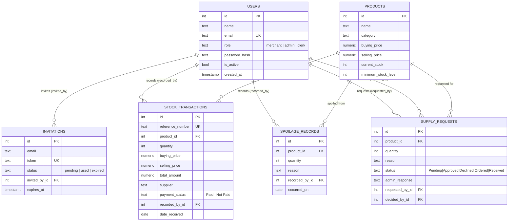

# MyDuka database schema

Design only — not wired into any backend yet. Full DDL lives in
[`db-schema.sql`](./db-schema.sql); this doc is the ERD and the reasoning
behind a few non-obvious choices.

## Entity relationship diagram

## Design decisions

**Single `users` table, no `stores` table.** The frontend has no concept of
multiple stores — one merchant, its admins, and its clerks. Adding
multi-tenancy would be speculative; nothing in the UI exercises it.

**No `payments` table.** `AdminUnpaidStock.jsx` and `demoApi` both treat
"unpaid stock" as just `stock_transactions` filtered by `payment_status`, and
"mark as paid" as flipping that one column. There's no partial-payment or
multiple-payments-per-delivery concept anywhere in the app, so a separate
payments table would model something the product doesn't have.

**`stock_status` is not a column.** `products` stores `current_stock` and
`minimum_stock_level`; "In Stock" / "Low Stock" / "Out of Stock" is derived
at query time (`current_stock <= minimum_stock_level`, `current_stock == 0`),
matching exactly what `demoApi.getInventory()` computes today. Storing it
would risk drifting out of sync with the numbers it's derived from.

**Prices are duplicated onto `stock_transactions`.** A product's
`buying_price`/`selling_price` can change between deliveries; each
transaction keeps the price that was true *at the time it happened*, and
`products.buying_price`/`selling_price` is just "the current price," updated
on receipt (as `demoApi.receiveStock` already does).

**`invitations.invited_by_id` and `supply_requests.decided_by_id`** aren't
tracked by the current localStorage demo, but a real backend needs both for
an audit trail — who invited this admin, who approved/declined this request.

**Constraints enforce rules the frontend currently only checks in
JavaScript** — e.g. `spoilage_records.quantity > 0` and `products.current_stock
>= 0` back up the "can't spoil more than you have" rule in
`demoApi.recordSpoilage`, which today lives only in the browser and would
otherwise be trivially bypassable once a real API exists.
